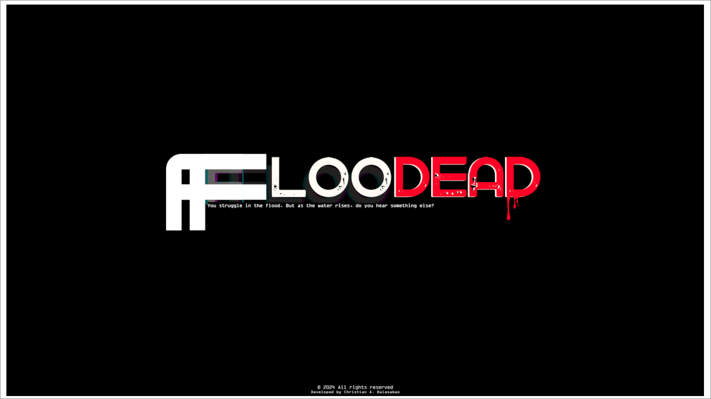
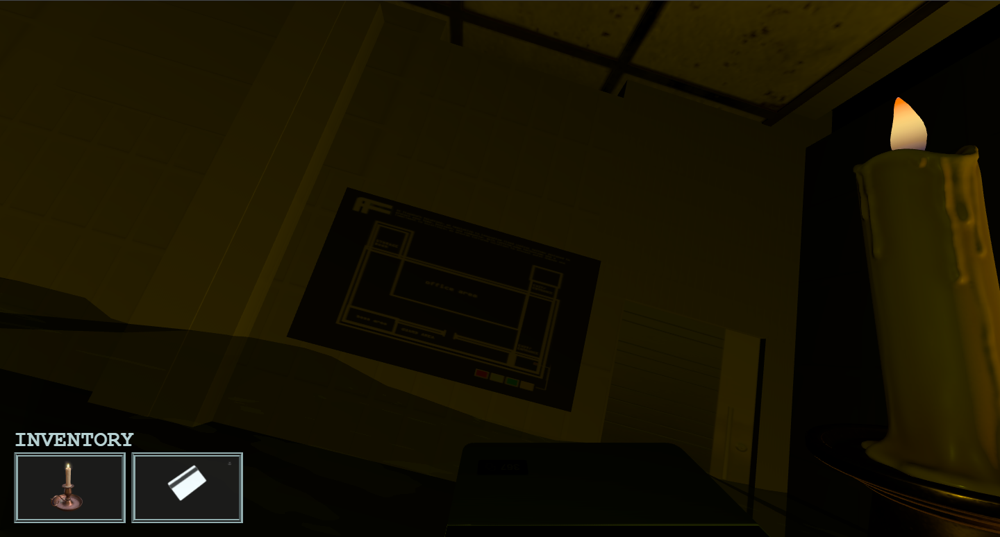
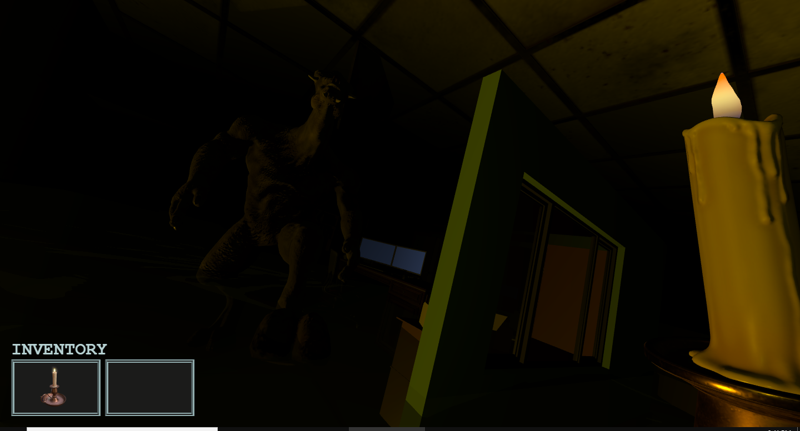
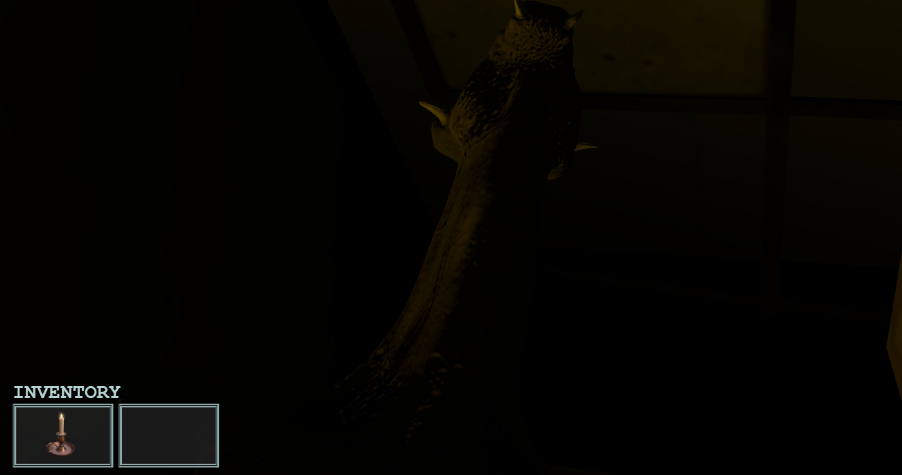
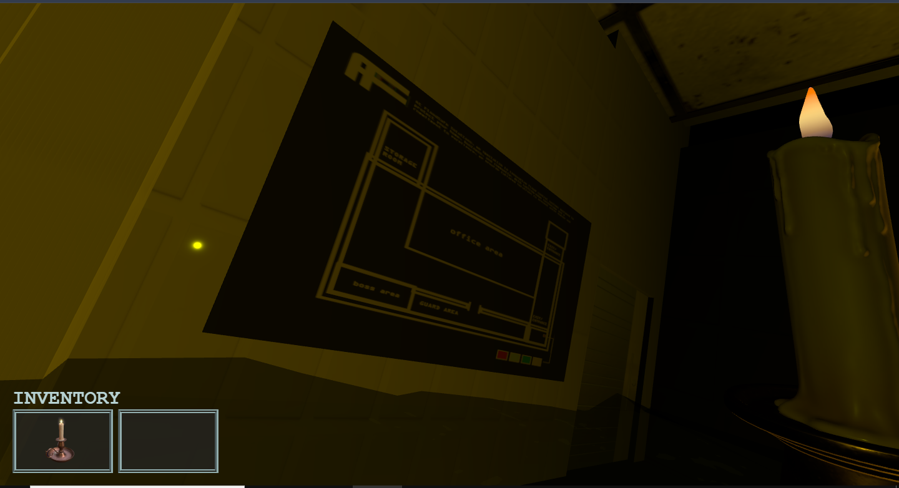

# Floodead 🩸

> *You struggle in the flood. But as the water rises... do you hear something else?*

<table align="center">
      
</table>
---


|    |    |   |
|:------------------------------:|:------------------------------:|:------------------------------:|
| Escape Puzzle                | Monster Encounter                | Discover the Truth             |

---

## About the Game 🎮

**Floodead** is a browser-based horror survival game built using **Three.js**, a 3D graphics library that runs directly in the browser via WebGL. The game simulates a haunting flood scenario enhanced by dynamic water effects, fog, eerie lighting, and real-time monster AI. Built with JavaScript and shaders, this experience offers tension, atmosphere, and exploration — all in the browser.

---

## Story Synopsis 📖

After a catastrophic earthquake triggers a massive tsunami and storm, you're trapped inside a flooded office building. You wake up injured and alone, surrounded by darkness and rising waters. But you're not alone — something monstrous was swept in with the flood.  
Explore your surroundings, uncover clues, and find a way to escape — before the flood (and the beast) finds you first.

---
⚠ **Note:** This game is in early demo phase. Some features like puzzles and door logic are incomplete, but the game is playable and interactive.  
🔑 **Door password (for demo):** `1532`


## Features ✨

- 🌊 Realistic water and flood simulation using shaders  
- 💡 Atmospheric lighting and fog for horror immersion  
- 🧠 AI-driven monster that reacts to player movement  
- 🧩 Puzzle mechanics and locked doors (demo version includes password: `1532`)  
- 🔊 Ambient audio design with storm and creature sounds  
- 🕹️ WASD or Arrow Key movement with first-person navigation  

---

## 🎮 Try It Online

Play **Floodead** instantly in your browser—no setup needed:  
[https://floodead-threejs-horrorgame.vercel.app](https://floodead-threejs-horrorgame.vercel.app)

---

## How to Play Locally 🕹️

Follow these steps to run the game on your local machine:

1. Clone the repository:
    ```bash
    git clone https://github.com/parkqdev/FlooDead-ThreeJS-Horror-Game-.git
    cd FlooDead-ThreeJS-Horror-Game-
    ```

2. Install dependencies:
    ```bash
    npm install three
    npm install --save-dev vite
    ```

3. Start the development server:
    ```bash
    npx vite
    ```

4. Open the URL shown in your terminal (usually `http://localhost:5173`) in your browser

5. Use **WASD** or arrow keys to move your character  
6. Explore the building, avoid the monster, and gather clues  
7. Solve puzzles to unlock doors and escape

---

## Tech Stack 🛠️

- [Three.js](https://threejs.org/) — Web-based 3D rendering engine  
- WebGL & GLSL — for shader-based lighting, fog, and water effects  
- JavaScript — for gameplay logic and monster AI  
- [Vite](https://vitejs.dev/) — Lightning-fast dev environment  

---

## Contributing 🤝

Found a bug? Have suggestions? Want to help expand the game?  
Feel free to open an [issue](https://github.com/parkqdev/FlooDead-ThreeJS-Horror-Game-/issues) or submit a pull request. Feedback is appreciated!

---

## License 📄

This project is licensed under the **MIT License**.  
See [LICENSE](./LICENSE) for more information.
