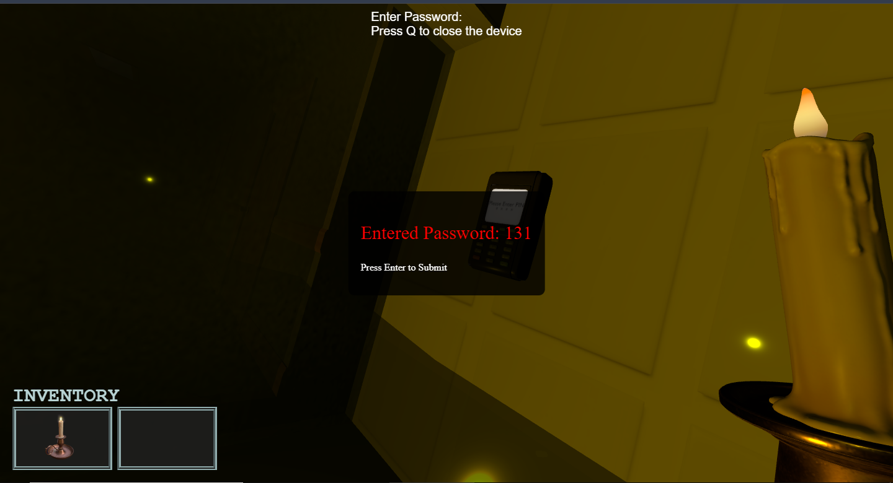
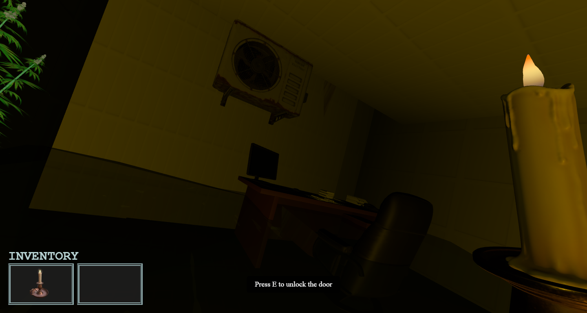

# Floodead 🩸

> *You struggle in the flood. But as the water rises, Do you hear something else?.*

---

## 🎥 Screenshots

|    |    |   
|:------------------------------:|:------------------------------:|:------------------------------:|
| Escape Puzzle                | Monster Encounter                | Discover the truth


---

## About the Game 🎮

**Floodead** is a browser-based horror survival game created using **Three.js**, a powerful JavaScript 3D library. The game leverages WebGL and GLSL shaders to deliver immersive water effects, lighting, and fog directly in your browser. The monster AI, environmental effects, and gameplay logic are all built with JavaScript, providing an atmospheric, real-time 3D experience.

---

## Story Synopsis 📖

After a massive earthquake triggers a tsunami and storm, you wake up trapped inside a flooded office building. Injured by falling debris, you find yourself alone in the dark, with rising floodwaters threatening your survival. But worse, a giant monster, stranded alongside you, stalks the corridors. Your goal is to explore the building, collect clues, and find a way to escape before the flood and the beast close in.

---

## Features ✨

- 🌊 Dynamic flood simulation with realistic water effects  
- 💡 Eerie lighting and fog created using GLSL shaders  
- 🖥️ Real-time 3D rendering powered by Three.js  
- 👾 Reactive monster AI sensitive to player movement and sounds  
- 🧩 Puzzle-solving elements (currently in demo stage)  
- 🔊 Immersive ambient soundscape including storm and monster noises  

---

## How to Play Locally 🕹️

Follow these steps to run the game on your local machine:

1. Clone the repository:
    ```bash
    git clone https://github.com/parkqdev/FlooDead-ThreeJS-Horror-Game-.git
    cd FlooDead-ThreeJS-Horror-Game-
    ```

2. Install dependencies and run with Vite:
    ```bash
    npm install --save-dev vite
    npx vite
    ```

3. Open the URL shown in your terminal (usually `http://localhost:5173`) in a modern browser (Chrome or Firefox recommended)

4. Use **WASD** or arrow keys to move your character

5. Explore the office, avoid the monster, and gather clues

6. Solve puzzles to unlock doors and escape

---

## Demo Note ⚠️

This game is currently in demo version. Some puzzles and door mechanics are still in development.  
🔑 **Door password (for demo):** `1532`

---

## Tech Stack 🛠️

- [Three.js](https://threejs.org/) for 3D rendering  
- WebGL & GLSL shaders for lighting, water, and fog effects  
- JavaScript for game logic and AI behavior  
- [Vite](https://vitejs.dev/) for fast local development  

---

## Contributing 🤝

Contributions, bug reports, and suggestions are welcome!  
Feel free to open [issues](https://github.com/parkqdev/FlooDead-ThreeJS-Horror-Game-/issues) or submit pull requests.

---

## License 📄

This project is licensed under the MIT License.
